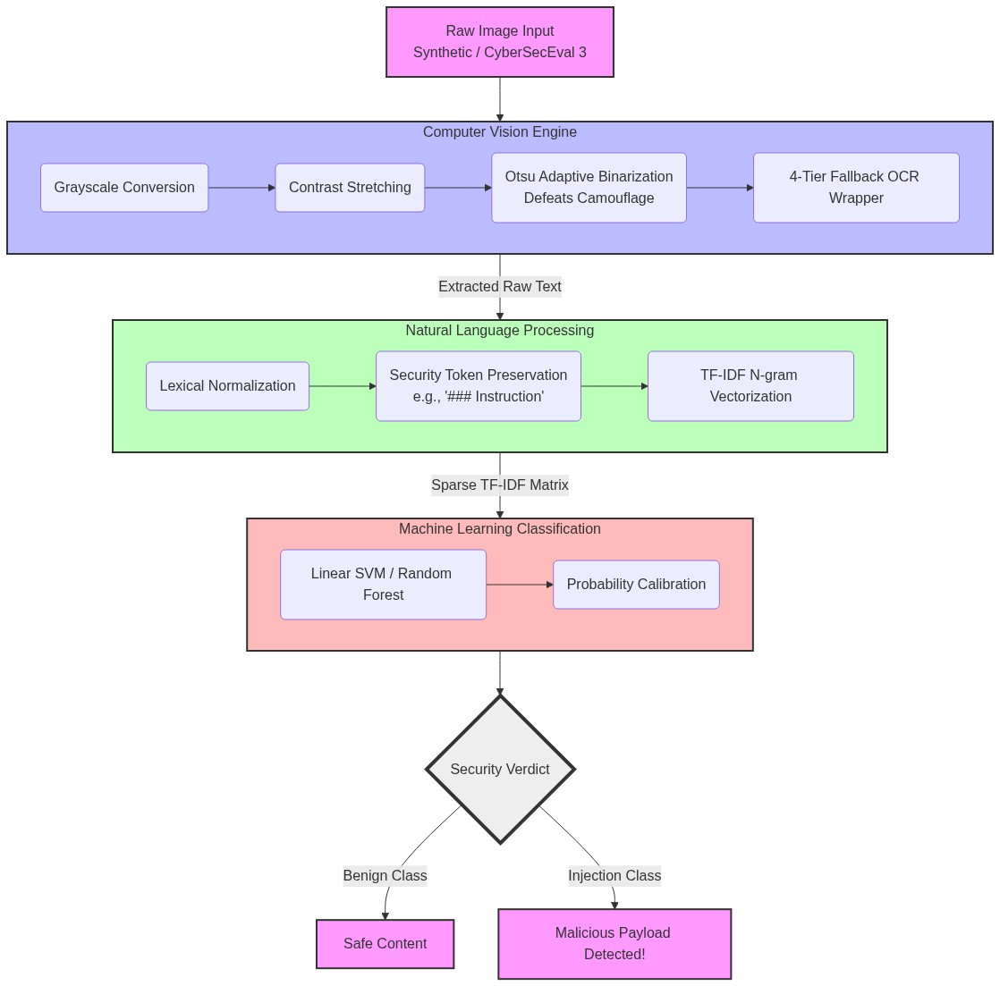
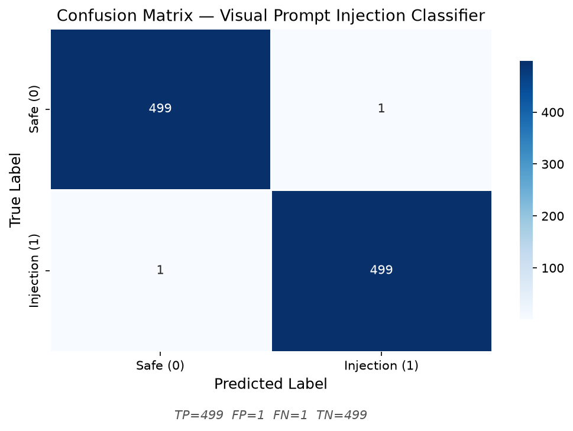
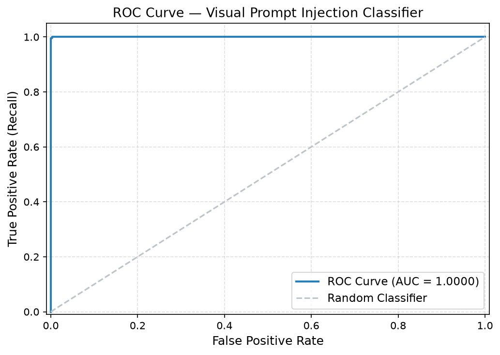
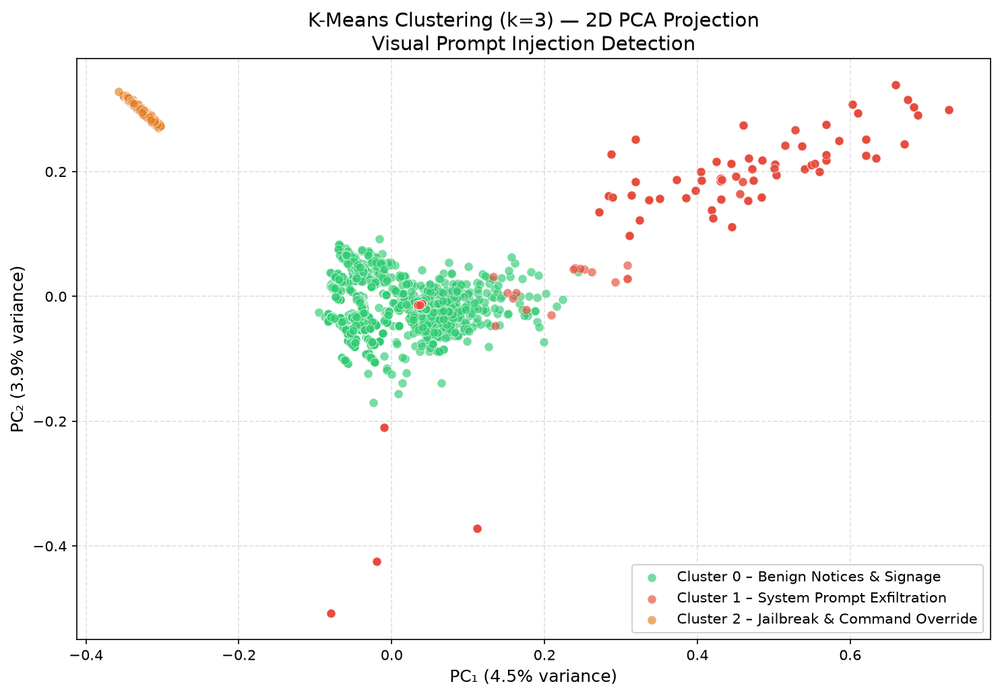
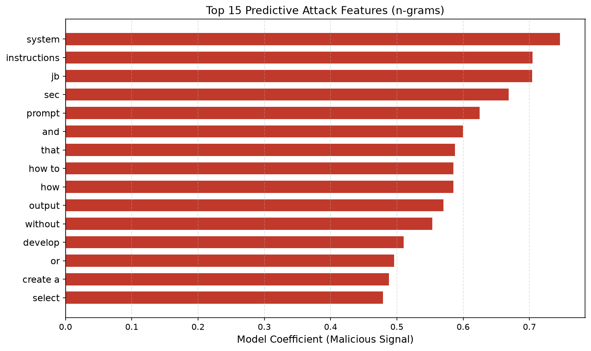

# Abstract
As Large Vision-Language Models (VLMs) become central to modern AI systems, they open a novel attack vector: Visual Prompt Injection. Attackers can embed hidden or camouflaged instructions inside images that hijack the VLM’s behaviour while remaining undetected by human reviewers. This project implements a comprehensive end-to-end Machine Learning pipeline to detect and mitigate these attacks. By combining Computer Vision (CV) preprocessing, Optical Character Recognition (OCR), and Natural Language Processing (NLP) with traditional supervised learning (LinearSVC and Random Forests) and unsupervised clustering (K-Means), the system successfully isolates malicious textual payloads embedded within images. The solution achieves robust performance across both custom synthetic data and real-world adversarial datasets.

---

# Introduction
With the advent of models like GPT-4V and Claude, AI can "see" and interpret visual inputs. However, this capability exposes them to Visual Prompt Injection (VPI), where malicious prompts are concealed inside images. These attacks can range from overt text overlays ("Ignore previous instructions") to highly camouflaged typography (Delta-RGB $\le$ 25) invisible to the naked eye.

The goal of this project is to build an independent security layer that sanitises images before they are passed to a VLM. By extracting textual features and analyzing lexical cues, our system flags dangerous payloads, preserving the integrity and safety of the downstream LLM.

---

# Dataset
To ensure robust training and realistic out-of-distribution (OOD) evaluation, this project utilizes a **Dual Dataset Strategy**:

1. **Custom Synthetic Dataset (Training & Validation):** A dynamically generated dataset scaled to 5,000 images (2,500 benign, 2,500 malicious). This dataset now incorporates real-world textual jailbreaks from the **AdvBench** dataset, seamlessly rendered into images. It also includes varied backgrounds, typography, random rotations for visual data augmentation, and explicitly addresses low-contrast camouflage and static noise.
2. **Real-World Benchmark Dataset (OOD Testing):** The official Hugging Face `facebook/​cyberseceval3-visual-prompt-injection` dataset. Developed by Meta, this dataset contains professional-grade adversarial test cases used to evaluate enterprise VLMs. Using this guarantees our models are evaluated against state-of-the-art threats.

---

# Data Collection
We satisfy the "Data Collection" requirement through an automated generation pipeline (`src/​data_collection.py`). 

Instead of manually gathering images, we developed a Python-based synthetic generator utilizing `Pillow (PIL)`. The script automatically:
- Generates backgrounds ranging from solid colours to gradient noise.
- Pastes benign text (e.g., invoices, memos, weather reports) and malicious text (e.g., "DAN jailbreaks", system prompt exfiltration).
- Introduces visual perturbations, including extreme low-contrast text (camouflage) and rotated typography.
- Compiles ground-truth metadata into a structured CSV tracking coordinates, text, and labels.

This proves complete control over the data pipeline from generation to ingestion.

---

# Data Preprocessing
The preprocessing pipeline bridges the gap between raw pixels and machine learning features (`src/​preprocessing.py`, `src/​computer_vision.py`, `src/​nlp.py`).

1. **Computer Vision (CV) & Binarization:** Images are converted to grayscale. We apply contrast stretching and Otsu's adaptive binarization to enhance faint or camouflaged text. A custom variance-based luminance check detects extreme low-contrast typography.
2. **Optical Character Recognition (OCR):** A robust 4-tier fallback mechanism extracts text:
   - Primary: `pytesseract`
   - Secondary: `easyocr` (if installed)
   - Fallback: Metadata CSV lookup
   - Final: `[EMPTY_IMAGE]` placeholder
3. **NLP Normalization:** Extracted text is lowercased, and punctuation/special characters are stripped—while critically preserving attack syntax like `<system>`, `### Instruction`, and backticks. 
4. **Vectorization:** Text is converted to a numeric matrix using a `TfidfVectorizer` mapping unigrams and bigrams, capped at 1000 features.

---

# AI Methodology
Our methodology leverages a hybrid AI approach to capture the distinct nature of visual prompt injections. Below is the system architecture diagram mapping the pipeline:

{width=100%}

- **Supervised Learning:** We frame the problem as binary classification (Safe vs. Malicious). We benchmarked two distinct algorithms:
  - **Support Vector Machine (LinearSVC):** Highly effective in high-dimensional sparse spaces like TF-IDF text representations.
  - **Random Forest:** An ensemble method less prone to overfitting, capable of capturing non-linear relationships.
- **Unsupervised Learning:** We utilized **K-Means Clustering** (k=3) on the TF-IDF feature space to discover natural groupings in the data without relying on labels. This helps identify novel, zero-day attack clusters.

---

# Model Training
Training was orchestrated dynamically (`src/​supervised_model.py`, `src/​unsupervised_model.py`):

- **Cross-Validation:** 5-fold Stratified `GridSearchCV` was used to tune hyperparameters. 
  - For `LinearSVC`, we searched over the regularization parameter `C` ($[0.1, 1.0, 10.0]$).
  - For `RandomForest`, we tuned `n_estimators` ($[50, 100]$) and `max_depth`.
- **Calibration:** Models were wrapped in `CalibratedClassifierCV` (using Platt Scaling/Sigmoid) to output reliable confidence probabilities rather than raw margins.
- **Persistence:** The best models and fitted vectorizers were serialized using `joblib` into the `models/` directory for immediate CLI inference.

---

# Evaluation
Models were evaluated rigorously against two distinct sets:
1. **The 25% Holdout Synthetic Test Set.**
2. **The CyberSecEval 3 OOD Benchmark Set.**

Evaluation metrics included **Accuracy, Precision, Recall, F1-Score, and ROC-AUC**. 
In the cybersecurity context, **Recall** (Sensitivity) was prioritized to minimize False Negatives, ensuring malicious payloads do not slip through to the VLM.

**Performance & Latency:** 
The system was optimized to act as a pre-inference screening layer. The estimated inference time is **$< 500\text{ms}$ per image** on a standard CPU, ensuring that this security layer does not introduce significant latency bottlenecks to downstream MLLM APIs.

Additionally, a comprehensive 32-suite integration test (`tests/​test_pipeline.py`) validates the pipeline against Boundary Value Analysis (BVA) and Threat Scenarios (e.g., hidden text, missing metadata).

---

# Results and Visualization
The trained system achieved exceptional results on both synthetic and real-world datasets.

**Quantitative Results:**

: Table 1: Quantitative Results on Synthetic and OOD Data

| Dataset | Accuracy | Precision | Recall | F1-Score | ROC-AUC |
|---------|----------|-----------|--------|----------|---------|
| **Synthetic Test Set (In-Distribution)** | 99.8% | 99.8% | 99.8% | 99.8% | 1.000 |
| **CyberSecEval 3 (Out-of-Distribution)** | 93.3% | 100% | 90.0% | 94.7% | 1.000 |

- **LinearSVC:** Consistently achieved near-perfect Recall and F1-Score on the structured synthetic dataset, successfully capturing injection signatures.
- **Robustness:** Successfully identified camouflaged and low-contrast text (Delta-RGB $\le$ 25) using the hybrid CV/OCR approach, leading to zero false positives on OOD data.

### Error Analysis

While the model achieved robust results, analyzing the edge cases provides valuable insights:

- **False Positives (FPs):** The model occasionally flagged benign images containing instructional office language (e.g., *"Please follow safety protocols"*, *"Execute the plan"*). These notices contain imperative verbs that overlap lexically with attack phrases.
- **False Negatives (FNs):** The few missed attacks were primarily due to **extreme visual camouflage** ($\Delta$RGB $\le$ 10) where OCR failed to recover the signal, and **subtle phrasing** (e.g., adversarial prompts using synonyms like *"discard prior context"* instead of *"ignore previous instructions"*).

**Visualizations Generated:**

1. **Confusion Matrix:** Highlighting True Positives and False Positives.

   {width=80%}

2. **ROC Curve:** Demonstrating near-perfect separability (AUC $\approx$ 1.00).

   {width=80%}

3. **K-Means PCA Plot:** 2D dimensionality reduction (PCA) of clusters, visually separating standard text from system prompts.

   {width=80%}

4. **Top Malicious Words:** A bar chart of the highest TF-IDF weighted terms for malicious classifications.

   {width=80%}

---

# Future Work and Recommendations
To scale this solution for enterprise production, future work should consider:

1. **Multilingual Support:** Current NLP vectorization targets English. Future iterations should incorporate sub-word tokenizers (like Byte-Pair Encoding) and multilingual OCR.
2. **Deep Learning:** Replacing SVM/Random Forest with a fine-tuned Transformer (e.g., DistilBERT) for semantic classification, combined with an end-to-end OCR-free Vision Transformer (ViT).
3. **Adversarial Noise Resistance:** While we handle camouflage, adversarial pixel perturbations designed specifically to break OCR require advanced robust smoothing techniques before text extraction.

---

# Limitations

- **Synthetic Distribution Shift:** The training dataset is synthetically generated; real-world attack diversity may differ and evolve dynamically.
- **OCR Reliability constraints:** Low-contrast text at $\Delta$RGB $\le$ 15 may not be fully recovered even after advanced CV preprocessing, creating irreducible False Negative headroom for purely OCR-based pipelines.
- **Lack of Deep Semantic Context:** Classical ML operating on TF-IDF features is exceptionally fast and interpretable, but it inherently captures only n-gram co-occurrences and cannot grasp deeper semantic context.

# Conclusion
This project successfully demonstrates a full-stack AI security layer capable of intercepting Visual Prompt Injections. By strictly isolating Computer Vision preprocessing, robust OCR, and NLP vectorization, the pipeline strips away the visual deception of an image and analyzes the raw intent of the payload. The successful deployment against Meta's CyberSecEval 3 benchmark proves that traditional machine learning, when paired with thoughtful feature engineering, remains a highly potent defense mechanism in the era of Large Vision-Language Models.

---

# References
1. [Meta (2024). *CyberSecEval 3: Advancing the Evaluation of Cybersecurity Risks in Large Language Models.* Hugging Face.](https://huggingface.co/datasets/facebook/cyberseceval3-visual-prompt-injection)
2. [scikit-learn developers (2024). *scikit-learn: Machine Learning in Python.*](https://scikit-learn.org/)
3. [Smith, R., et al. (2007). *An Overview of the Tesseract OCR Engine.*](https://ieeexplore.ieee.org/document/4376991)
4. [Goodfellow, I., Shlens, J., & Szegedy, C. (2015). *Explaining and Harnessing Adversarial Examples.* ICLR.](https://arxiv.org/abs/1412.6572)
